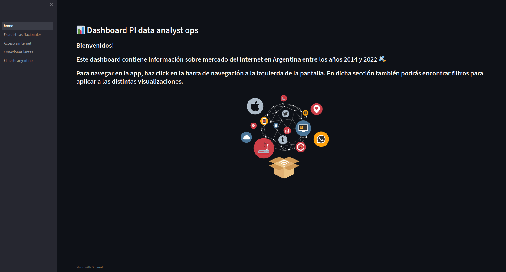
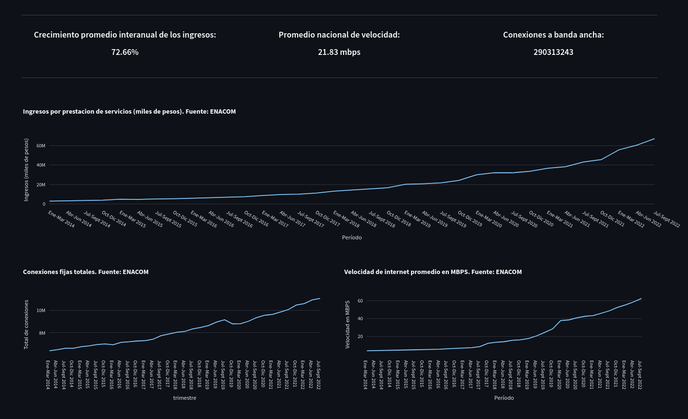
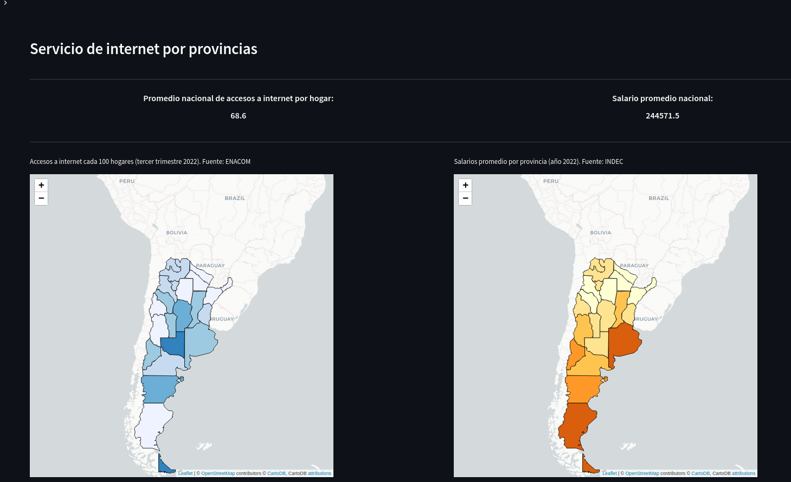
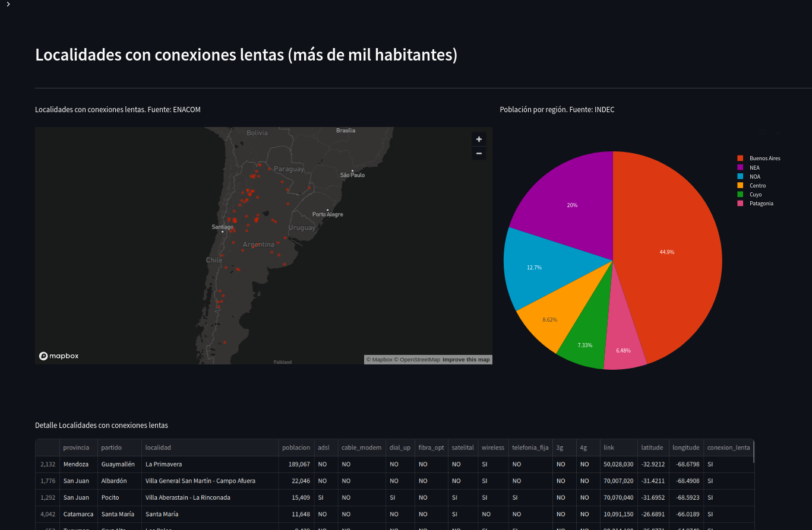
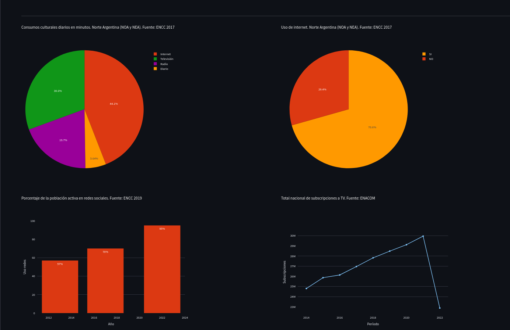

# PI DATA ANALYST OPS

El creciente uso de internet por parte de los seres humanos ha constituido uno de los principales factores explicativos de los cambios experimentados por las sociedades modernas a lo largo del SXXI, por lo que el análisis de las tendencias relativas a este se ha vuelto una práctica imperativa en nuestros días para todas las organizaciones que constituyen el cuerpo social.

Este proyecto tiene el objetivo de generar información sobre el mercado del internet en Argentina en el año 2022 con el fin de otorgar lineamientos para la inversión en dicho mercado en el ciclo económico subsiguiente.

Para ello se ingestaron datos de diversas fuentes (API ENACOM, ENCC 2017 y 2019, Censo Nacional de Población, Hogares y Viviendas del año 2022) en una base de datos MYSQL (previamente adecuados con Libre Office Calc) que fueron luego leídos (PyMYSQL), explorados, transformados y analizados/visualizados con Python (pandas, plotly, streamlit y otras librerías).
Se puede clonar el repositorio ejecutando:

    $ git clone https://github.com/frangr94/pi_data_analyst

Las visualizaciones fueron creadas con Streamlit y se pueden ejecutar localmente con el comando:

    $ streamlit run home.py

#### Nota: es necesario tener instaladas las librerías que utiliza el script.

Esto abrirá la siguiente pantalla en su navegador por defecto:

Ahora puedes navegar en la app como lo desees.

En _Estadísticas nacionales_ se pueden ver datos sobre las conexiones a nivel nacional:

Los gráficos en ésta página aportan información bastante interesante:
* El crecimiento del  mercado del internet ha tenido un crecimiento con una aceleración cada vez mayor desde el año 2014 hasta la actualidad, tanto en velocidad como en cantidad de conexiones.
* Los ingresos percibidos por la prestación del servicio del internet ha tenido un crecimiento concomitante al desarrollo de las redes de internet.
* Ergo, expandir la red implica un aumento paralelo de los ingresos.

En _Acceso a internet_ se pueden ver datos sobre el acceso a internet y los ingresos de los argentinos:

De este apartado se pueden sacar algunas conclusiones:
* En terminos generales el norte argentino es la zona más relegada en términos de acceso a internet, aunque la provincia de Santa Cruz también presenta un nivel de acceso bastante bajo. 
* A su vez, las provincias del norte presentan los niveles de ingresos más bajos del país. Santa Cruz, al contrario, presenta unos de los niveles de ingresos más altos.
* En este sentido, la provincia de Santa Cruz se presenta como una buena oportunidad de inversión: aunque no tenga muchos habitantes, sus ingresos son altos y probablemente haya mucha demanda de servicios de internet.
* Teniendo en cuenta la escasa población de la provincia de Santa Cruz, hay que mirar al norte si se desea expandir la red de internet

En _Conexiones lentas_ se pueden ver las localidades demandantes de internet:

Aquí, se pueden ver las localidades que no tienen acceso a internet por fibra óptica o 4g, por lo que han sido etiquetadas como localidades con conexiones lentas: se muestran aquellas con más de mil habitantes por considerarlas potenciales mercados:
* Se puede apreciar que la mayoría de las localidades se ubica en el norte argentino, aunque la más poblada está en Mendoza.
* Si bien el norte comprende el 30% de la población, es la zona que peor conectividad presenta.
* Es urgente llevar un buen servicio de internet a esa zona.

En _El norte argentino_ se pueden ver datos sobre consumos digitales en el norte del país:

Los datos graficados otorgan información sobre los consumos digitales de los habitantes del NEA y NOA:
* La mayoría de las horas empleadas para consumos culturales se pasan en internet.
* El 70% de los encuestados usaba internet en el año 2017
* Para 2019, el 95% de los encuestados declaró estar activos en redes sociales.
* La cantidad de subscripciones a televisión ha sufrido una caída abrupta en el año 2022: es una gran oportunidad para el internet.

El repositorio cuenta además con otros archivos pertinentes:

* En el archivo EDA.ipynb se puede apreciar el análisis exploratorio realizado sobre los datos: fue un paso importante para la lectura de los mismos ya que presentaban algunos problemas que era necesario resolver para generar un correcto análisis.

* El archivo ingesta_pandas.ipynb contiene la lectura de los datos desde MYSQL y las transformaciones que fue necesario hacer para el correcto funcionamiento del repositorio.

* En los directorios datasets y datasets_ordenados se encuentran los archivos (.csv) necesarios para la ejecución del script.

